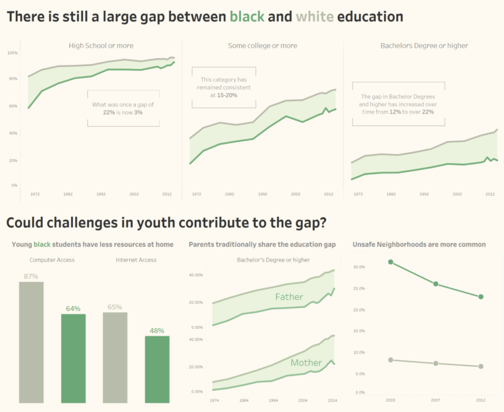
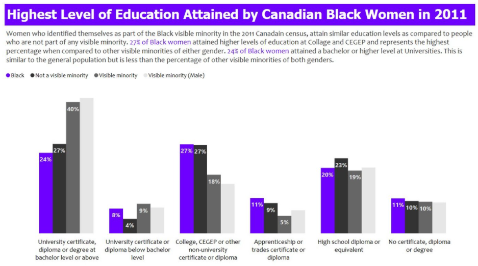
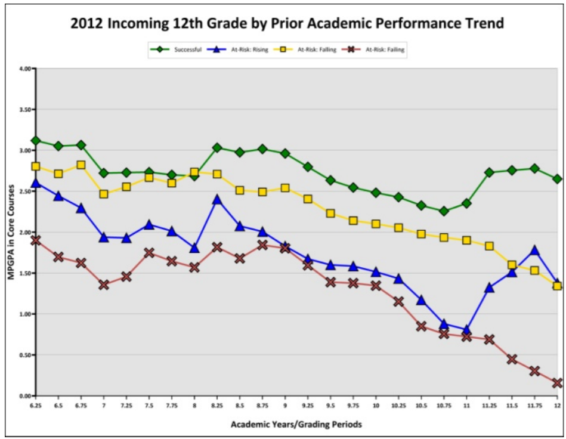
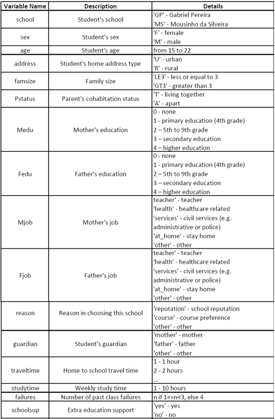
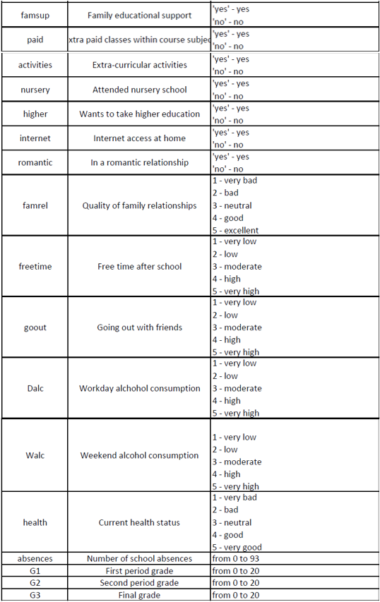

```{r setup, include=FALSE}
knitr::opts_chunk$set(echo = TRUE)
```

# 1. Introduction

Many factors can impact a person’s academic performance, family background and one’s lifestyle are two of the larger factors. The influence of family background may include financial status in the family’s ability to provide educational support, stability at home to provide emotional and mental support, among others. On the other hand, one’s lifestyle choices such as what he or she chooses to do during their free time, amount of time they spend on studying may have impact on one’s grades.

Since there are many sub-factors in family background and lifestyle choices, the motivation of this study is hence to look deeper at these sub-factors to see which are the factors that have a greater correlation in the impact on a student’s grades. More specifically, this study aims to study the correlation between each factor and a student’s grades, as well as aiming to build a model that can accurately determine the academic performance of a student. From the findings, targeted help may be administered to students in these specific areas attributing to poor grades in school, therein helping them have a higher chance of a better future. 

Here, exploratory data analysis for the data set will be discussed and performed, which will be part of a module in a full Shiny-based Visual Analytics Application project. 


# 2. Literature Review

Based on literature review on exploratory analysis performed for similar data sets involving education/grades, most provide a time-based analysis on grades where trends of variables are observed over time. 

```{r echo=FALSE, message=FALSE, warning=FALSE}

```

```{r echo=FALSE, message=FALSE, warning=FALSE}

```

Asides from that, a few provided simple bar charts to compare the target variable against others in different aspects. For example, a comparison of proportion between blacks and other minority groups in having various education certificates.

```{r echo=FALSE, message=FALSE, warning=FALSE}

```

This third chart is most similar to what will be attempted in this report, to explore proportions of the different variables and more. Due to the large number of variables in this study, it would make sense to include interactivity to allow the user to select variables for further analysis, rather than to generate more than twenty plots at one go. Also, they do not provide statistical comparisons between inputs for each variable. Another improvement would be the inclusion of number of data points and providing a visualization of boxplots, to better visualize the basic statistics of the variables. 


# 3. Data Extraction and Preparation

## 3.1 Install/Load R Packages

A list of packages are required for this protyping report. This code chunk installs the required packages for testing and loads them onto RStudio environment.

```{r}
# Load packages
packages = c('readr', 'dplyr', 'tidyverse', 'plyr', 'ggstatsplot', 'ggplot2', 'ggpubr', 'corrplot', 'plotly', 'ggcorrplot', 'rstantools', 'fastDummies')
for(p in packages){
  if(!require(p,character.only = T)){
    install.packages(p)
  }
  library(p,character.only = T)
}
```


## 3.2 Data Preparation and Cleaning

The data set used in this report is from [Kaggle](https://www.kaggle.com/uciml/student-alcohol-consumption), which contains two csv files, student-mat.csv and student-por.csv. The data was obtained from a survey of Portuguese students aged 15 to 22 from mathematics and Portuguese language course. The data was obtained through a survey on family demographics, lifestyle factors, along with their grades in mathematics and Portuguese language. The data set contains other variables that can be broadly classified into family demographics and lifestyle factors. 

Below shows the metadata for the data set:

```{r echo=FALSE, message=FALSE, warning=FALSE}

```

```{r echo=FALSE, message=FALSE, warning=FALSE}

```

First, both csv files were imported by using the following code chunk utilizing read_csv(). Subsequently, a check was done to see if there were any null values. Given a FALSE output, we can proceed without having to deal with any null inputs. 

```{r}
# Import the data and combine them
data_all <- list.files(path = "data",
                       pattern = "*.csv", full.names = TRUE) %>% 
  lapply(read_csv) %>%                                          
  bind_rows

# Test for any null values
is.null(data_all)
```

Since some further manipulation will be done on the data along the way, data_cleaned was created to perform these manipulations while retaining the raw data available in data_all in case it is needed. Reviewing the data, we know that there are some variables that should be ordinal data, such as "Dalc" which is the workday alcohol consumption, with inputs ranging from 0 to 4 representing very low intake to very high intakes. Hence, another step to change these data to ordinal data along with the order was performed. 

```{r}
# Duplicate data for further manipulation
data_cleaned <- data_all
```


```{r}
# Setting ordinal data levels
data_cleaned$Medu <- factor(data_cleaned$Medu, order = TRUE,
                            levels = c("0", "1", "2", "3", "4"))

data_cleaned$Fedu <- factor(data_cleaned$Fedu, order = TRUE,
                            levels = c("0", "1", "2", "3", "4"))

data_cleaned$failures <- factor(data_cleaned$failures, order = TRUE,
                            levels = c("0", "1", "2", "3"))

data_cleaned$famrel <- factor(data_cleaned$Medu, order = TRUE,
                            levels = c("1", "2", "3", "4", "5"))

data_cleaned$freetime <- factor(data_cleaned$freetime, order = TRUE,
                            levels = c("1", "2", "3", "4", "5"))

data_cleaned$goout <- factor(data_cleaned$goout, order = TRUE,
                            levels = c("1", "2", "3", "4", "5"))

data_cleaned$Dalc <- factor(data_cleaned$Dalc, order = TRUE,
                            levels = c("1", "2", "3", "4", "5"))

data_cleaned$Walc <- factor(data_cleaned$Walc, order = TRUE,
                            levels = c("1", "2", "3", "4", "5"))

data_cleaned$health <- factor(data_cleaned$health, order = TRUE,
                            levels = c("1", "2", "3", "4", "5"))

```


## 3.3 Initial Data Analysis

As the grades in this data set involves students from two different schools and two different subjects, we will need to find out if the results for each of them are statistically different from the other. Also, since 3 grades are given, G1, G2 and G3, representing results from the first period, second period, and the final grade, we also want to find out if there is any statistically significant difference between the results. For the analysis, ANOVA technique will be used and a new data set with the required variables - school, G1, G2, G3 and subject will be used. 

Further data manipulation was done to firstly create a new data set with the required variables, then creating a new data perform pivoting for the grades. 

```{r} 
# Creating pivot data for G1, G2 and G3
anova_data <- data_cleaned[, c("school", "G1", "G2", "G3", "subject")]
anova_data_pivot <- pivot_longer(anova_data, -c(school, subject), values_to = "Score", names_to = "G")
```

**Difference in Grades**

The data set provides results through 3 variables (G1, G2, G3) while the goal would be to have a single target grade variable for further analysis, which will make sense if the three variables are not statistically different. For the comparison between grades, one way ANOVA will be used. As all the p-values generated are more than 0.05 for a 95% confidence level, we can say that the variables are not statistically different from each other. Hence, in order to have a single target grade, the average of the three variables will be used and named "avgscore". 

```{r} 
# Performing one-way ANOVA analysis
anova_grades <- aov(Score~G, data = anova_data_pivot)
anova(anova_grades)
```

```{r} 
# Creating new column for average score, then removing G1, G2 and G3
data_cleaned$avgscore <- ((data_cleaned$G1 + data_cleaned$G2 + data_cleaned$G3)/3)
data_cleaned = subset(data_cleaned, select = -c(G1, G2, G3))
```

**Difference in School and Subject**

Since there are two variables that we would like to analyze, a two-way ANOVA test was performed and showed that results for both schools and both subjects are significantly different. 

```{r} 
# Performing two-way ANOVA analysis
anova_twoway <- aov(Score~subject * school, data = anova_data_pivot)
anova(anova_twoway)
```


Since the grades are significantly different between schools and between grades, they will be analyzed separately in this report with the following four combinations:

- Gabriel Pereira + Math

- Gabriel Pereira + Portugese

- Mousinho da Silveira + Math

- Mousinho da Silveira + Portugese

```{r}
# Split by school
data_GP <- subset(data_cleaned, school == "GP")
data_MS <- subset(data_cleaned, school == "MS")

# Then split by subject
data_GP_math <- subset(data_GP, subject == "math")
data_GP_por <- subset(data_GP, subject == "por")
data_MS_math <- subset(data_MS, subject == "math")
data_MS_por <- subset(data_MS, subject == "por")

# Remove school and subject variable
data_GP_math = subset(data_GP_math, select = -c(subject, school))
data_GP_por = subset(data_GP_por, select = -c(subject, school))
data_MS_math = subset(data_MS_math, select = -c(subject, school))
data_MS_por = subset(data_MS_por, select = -c(subject, school))

```


# 4. Exploratory and Confirmatory Data Analysis

For EDA and CDA, there will be three sections to be worked on. First, will be a section to view the distribution of each variable, allowing the user to have a quick overview of each variable in terms of the proportions and distribution. Next, a section to compare the average results by different inputs in a variable. This will allow the user to compare the differences in average grades for each input, for example comparing the grades between students who have a family size of more than or less than 3. Lastly, a section to plot out the correlation between all the variables, including the average grade. This will allow the user to see the correlation strength between each variable, and each variable with the average grade. Further details for each section will be documented below.  

## 4.1 Section 1: Distributions and Proportions

For the initial exploratory analysis, we want to look at the distributions and proportions of the given data. While most of the variables can be visualized using a basic bar chart, some of the variables such as average score would be better visualized using a histogram due to the variable having a larger range of inputs. 

Here, ggplot2 package was used as the main package as it allows for basic editing of the chart such as the titles or colour schemes of the chart and below shows an example of each of the three charts. 

**Chart 1 (Bar Chart):**

The code chunk here using ggplot will plot a bar chart to visualize the distribution and proportions of variables. The proportion percentage of each input will be calculated and reflected on the chart itself for the user to readily have exact data on the proportions. This was made more obvious by adding transparency to the bar chart. 

The chart will include an option for the user to have two inputs. First, to select which of the data sets he or she would like to view - the four data sets split by school and subject, or the combined data. Second, the variable to study. For ordinal data, with the same code ggplot automatically colours them by gradient, with the lower levels being darker.

Example of proportion of students in the two schools for the combined data set:

```{r}
ggplot(data_cleaned) +
  aes(x = school, fill = school) +
  geom_bar(aes(x = school, fill = school), color = "black", alpha = 0.5) +
  geom_text(aes(label = scales::percent(..prop..), group = 1, y= ..prop.. ), stat= "count", vjust = -1.5) +
  ggtitle("Distribution and Proportion of Variables") +
  theme(axis.title.x = element_blank())
```

Example of proportion of students with indicated mother's job for the students in the Gabriel Pereira school taking math:

```{r}
ggplot(data_GP_math) +
  aes(x = Mjob, fill = Mjob) +
  geom_bar(aes(x = Mjob, fill = Mjob), color = "black", alpha = 0.5) +
  geom_text(aes(label = scales::percent(..prop..), group = 1, y= ..prop.. ), stat= "count", vjust = -1.5) +
  ggtitle("Distribution and Proportion of Variables") +
  theme(axis.title.x = element_blank())
```

Example of ordinal data, mother's education level of students in the whole data set:

```{r}
ggplot(data_cleaned) +
  aes(x = Medu, fill = Medu) +
  geom_bar(aes(x = Medu, fill = Medu), color = "black", alpha = 0.5) +
  geom_text(aes(label = scales::percent(..prop..), group = 1, y= ..prop.. ), stat= "count", vjust = -1.5) +
  ggtitle("Distribution and Proportion of Variables") +
  theme(axis.title.x = element_blank())
```


**Chart 2 (Histogram):**

The histogram chart includes a fill colour to avoid using black, and has a starting fixed bin width of 1. However, this input of the bin number will be an available input for the user to change. Furthermore, the plot will be presented using ggplotly package to allow the user to see the detail by hovering over each bar since the range of data could be very wide, for instance the number of absences which ranges from 0 to 75. Here, the user is able to input the data set as well as the variable he or she wishes to view as well. 

Example of number of absences for students in Gabriel Pereira school taking math:

```{r}
histo <- ggplot(data_GP_math) +
  aes(x = absences) +
  geom_histogram(binwidth=1, color="black", fill="light blue") +
  ggtitle("Distribution and Proportion of Variables") +
  theme(axis.title.x = element_blank())

ggplotly(histo)
```

Example of distribution of average scores for students in the whole data set:

```{r}
histo <- ggplot(data_cleaned) +
  aes(x = avgscore) +
  geom_histogram(binwidth=1, color="black", fill="light blue") +
  ggtitle("Distribution and Proportion of Variables") +
  theme(axis.title.x = element_blank())

ggplotly(histo)
```


## 4.2 Section 2: Comparison of Results 

This section looks at the difference in average grades between individual inputs in each variable. 

The ggplot2 package was first considered, and instead of just using a boxplot with jitters, a violin plot was used. This is because of the many data points which will cause the chart to look messy with the jittering, while the violin plot is able to show the distribution of data in a clean way. A statistical comparison between means was also implemented where the p-value would be indicated in the chart. 

However, testing out the plot generated by ggbetweenstats was found to be a better option due to several reasons. Aesthetically it provides a chart with better design, as well as automatically providing more information such as number of variable input size and the mean for each input. It also is able to produce a violin and boxplot to visualize the interquartile range and distribution of data points. 

As the grades for the subjects and schools have been shown to be significantly different, similar to Section 1, on top of a user input for the variable to study, a user input will be given for the selection of viewing data for different combinations of subjects and schools. The user will also be able to select the type of statistical test to be performed to compare the results within each variable. 

Example of chart using ggplot:

```{r}
# Attempt using ggplot
p <- ggplot(data_MS_math, aes(x = sex, y = avgscore, color=sex)) +
  geom_violin(position=position_dodge(1)) +
  geom_boxplot(color = "black", alpha=0.5)

p + stat_compare_means(label = "p.format", method = "t.test")
```

Example of chart using ggbetweenstats:

```{r}
# Attempt using ggbetweenstats
ggbetweenstats(
  data = data_cleaned,
  x = sex,
  y = avgscore,
  pairwise.display = all,
  results.subtitle = TRUE,
  bf.message = FALSE,
  type = "p",
  title = "Comparison of Variables Against Average Score")
```


## 4.3 Section 3: Correlation

In this section, correlation charts will be generated to compare the correlation between variables as well as to the target - average grade. Before plotting, dummy variables were created for the categorical variables. Subsequently, G1, G2 and G3 were removed since we are only interested in the average grade here. Since Medu and Fedu are categorical data in numerical form, the model.matrix did not capture this variable to create dummy variables. Hence, they were separately created. 

```{r}
# Creating dummy variables for categorical and non-numerical data
data_for_corr_all <- data_all
data_for_corr <- model.matrix(~0+., data=data_for_corr_all)
data_for_corr <- as.data.frame(data_for_corr)
data_for_corr = subset(data_for_corr, select = -c(G1, G2, G3))

data_for_corr <- fastDummies::dummy_cols(data_for_corr, select_columns = "Medu")
data_for_corr <- fastDummies::dummy_cols(data_for_corr, select_columns = "Fedu")
data_for_corr = subset(data_for_corr, select = -c(Medu, Fedu))

data_for_corr$avgscore <- ((data_all$G1 + data_all$G2 + data_all$G3)/3)
```

```{r}
# Resplitting by school and subject
data_cor_GP <- subset(data_for_corr, schoolGP == "1")
data_cor_MS <- subset(data_for_corr, schoolMS == "1")

data_cor_GP_math <- subset(data_cor_GP, subjectpor == "0")
data_cor_GP_por <- subset(data_cor_GP, subjectpor == "1")
data_cor_MS_math <- subset(data_cor_MS, subjectpor == "0")
data_cor_MS_por <- subset(data_cor_MS, subjectpor == "1")

data_cor_GP_math = subset(data_cor_GP_math, select = -c(subjectpor, schoolGP, schoolMS))
data_cor_GP_por = subset(data_cor_GP_por, select = -c(subjectpor, schoolGP, schoolMS))
data_cor_MS_math = subset(data_cor_MS_math, select = -c(subjectpor, schoolGP, schoolMS))
data_cor_MS_por = subset(data_cor_MS_por, select = -c(subjectpor, schoolGP, schoolMS))

```

In this section, the user will first be allowed to choose to view a static plot or interactive plot. The static plot uses an ellipse method, where based on the shade of colour and the direction of the ellipse, the correlation is clear between variables. This gives a general overview of the data and the respective correlations strengths. 

On the other hand, an interactive plot can be used should the user want to review the correlation in detail. Here, the user will be able to see the correlations value along with the two associated variables by hovering the cursor over the specific square. With the colours based on correlation, the user is also able to have a rough overview of the correlations as well.   

**Static Plot**

```{r}
data.cor = cor(data_cor_GP_math)
static_corr <- corrplot(data.cor,
         method = "ellipse", 
         type="lower",
         diag = FALSE,
         tl.col = "black",
         tl.cex=0.7)
```

**Interactive Plot**

```{r}
p.mat <- cor_pmat(data_cor_GP_por)

corr.plot <- ggcorrplot(
  data.cor, 
  type = "upper", 
  outline.col = "black",
  tl.cex=7,
  colors = c("red", "white", "blue"))
interactive_cor <- ggplotly(corr.plot)

interactive_cor
```


## 5. Conclusion

With interactivity implemented in the visualization, users can intentionally select the combinations of inputs that he or she wants to review further, and it helps clarity especially in data sets that have many variables. This will impact not just the total number of charts showing at one go, but the information that appears to the user. For example, the correlation plots. Should every box contain numerical data on correlation, it might be overwhelming for the user, compared to allowing the user to mouse over the data points to review. Adding statistical inputs for the charts also allows the user to make quick conclusions not based on a wild guess but based on mathematical calculations which allows the user to quickly analyze the data. 
